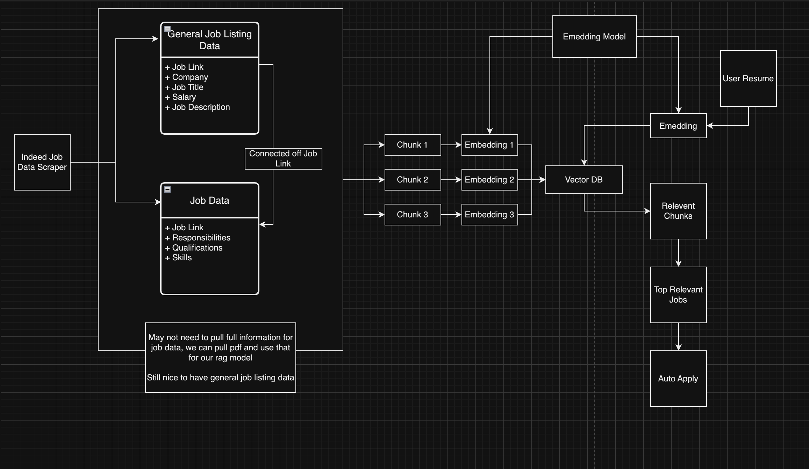
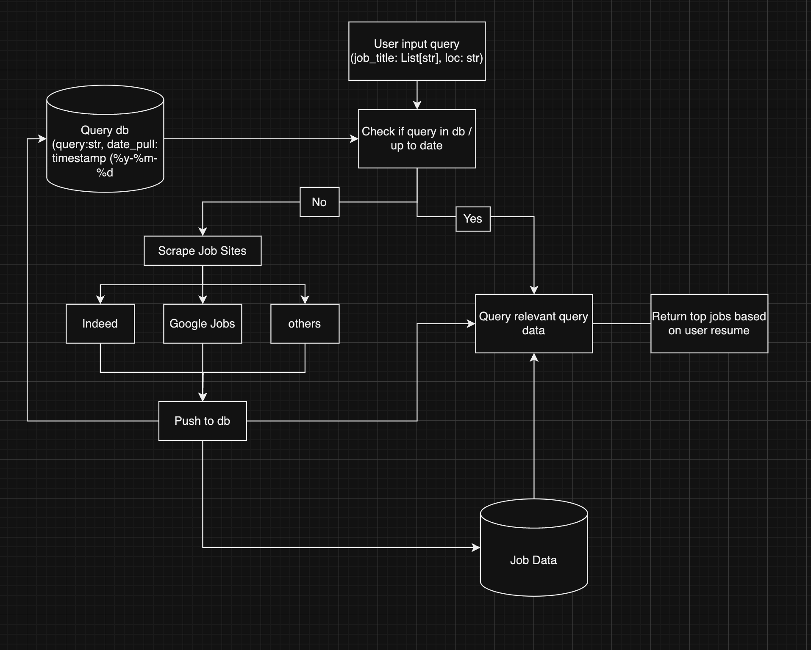

# CareerSageAI

This will allow users to search for jobs by entering a job title, location, and uploading their resume. The system scrapes top job websites, vectorizes the job descriptions, and uses a vectorized search method, similar to retrieval-augmented generation (RAG) models, to match the jobs based on the descriptions to the user's resume.

## Features

- **Job Search by Title and Location:** Users can input a job title and location to retrieve job listings from various job websites.
- **Resume Upload:** Users can upload their resumes in PDF format, which will be parsed and vectorized for comparison against job descriptions.
- **Vectorized Job Matching:** The system leverages vector embeddings to perform similarity matching between the job descriptions and the user's resume.
- **Top Job Websites:** The website scrapes from top job platforms (e.g., Indeed, LinkedIn) to gather job data.

## How It Works

1. **User Input:** The user enters a job title, location, and uploads their resume.
2. **Web Scraping:** The website scrapes job listings from external job websites based on the user's job title and location.
3. **Vectorization:** The uploaded resume and job descriptions are vectorized using embeddings.
4. **Job Matching:** The system compares the job descriptions to the user's resume using cosine similarity in the vector space.
5. **Results Display:** The best-matching job descriptions are displayed to the user, ranked by similarity score.

## Installation

### Prerequisites

- Python 3.10
- SQLite3
- Required Python packages: Install them using the following command

## System Design

The overall architecture of the website consists of several components that interact with each other to achieve job matching based on vectorized search. The main components include:

- **Frontend:** In progress - User will input (job title, location, resume)
- **Backend:** Handles web scraping, resume parsing, job vectorization, and job matching based on vector embeddings.
- **DataBase:** Stores job data that is scraped from job websites.
- **VectorStore:** Stores vectorized job descriptions for efficient similar search.

### Detailed System Workflow

1. **User Query**
2. **Web Scraping**
3. **Data Storage**
4. **Vectorization**
5. **Similarity Matching**
6. **Result Ranking**

## Code Design

This code follows a modular design, seperating the concerns into classes and utility functions for ease of maintenance and extensibility.

